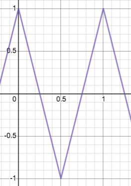

# Gotes

[](https://godoc.org/github.com/BennettJames/gotes)

Gotes ("go notes") is a just-for-fun, simple sound synthesis library for Go.
Design-wise, there is a strong emphasis on immutable function composition to
achieve synthesis. It's not terribly practical, but leads to very easy and
obvious composition.


(todo [bs]: to avoid boring the reader under a wall of explanation before
getting anywhere; let's include a sampler API that hits a few key elements,
along with a sound sample. I'd say maybe just something simple like )

```go
// todo (bs): this api is more theoretical than practical right now; let's
// adapt what I need to make it work. Unfortunately, this'll probably get into
// a broader issue.
gotes.Looper(
  PianoNote(2 * time.Second, gotes.NoteA3),
  PianoNote(2 * time.Second, gotes.NoteF3),
)
```


## Dependencies & Compatibility

Gotes is based on [oto](oto), a cross-platform Go library that dynamically links
platform-specific audio libraries. This was developed on an old mac mini; it
should be portable to other platforms but has not been thoroughly tested.


## Basics of Sound Waves

(note [bs]: I absolutely support doing a few sentences on the basic structure of
sound)

Here's a quick review of how sound works, for those who might not know or just
haven't thought much about it recently.

A quick refresher on sound: sound is just a wave.


rapid, tiny fluctuations in sound pressure.


 transmitted in tiny, rapid variations in
air pressure. For a computer to play back a sound,


The speaker then plays backs these

diaphragm


To play back sound, a digital wave is encoded that that rapidly oscillates with
small variations. Here is a simple sine

(record and insert .wav of a3 sine wave here)

Here is a set of some other simple waves

(todo [bs]: let's get smaller, plainer images of the waves here)

| Wave Type | Wave Form                                           | Sample |
| :---:     |   :---:                                             | :---:  |
| Sine      |                           | (todo) |
| Sawtooth  |                 | (todo) |
| Triangle  |                 | (todo) |
| Square    |                     | (todo) |


Different waves

(todo [bs]: let's include some description of using waves here. I'd argue in
favor of perhaps even getting the finite composition API together here, and
having a quick example with fadeout between the different types of waves)


## Composing Gote Functions


(todo [bs]: let's at least *try* to create a simple wasm example. Don't spend
too long on it - honestly I'd say create a plan, try to execute it within ten
minutes, then if you don't have a result decide whether it's worth continuing.)

(todo [bs]: let's also try to staple wav generation to this. There's )


[oto]:https://github.com/hajimehoshi/oto
